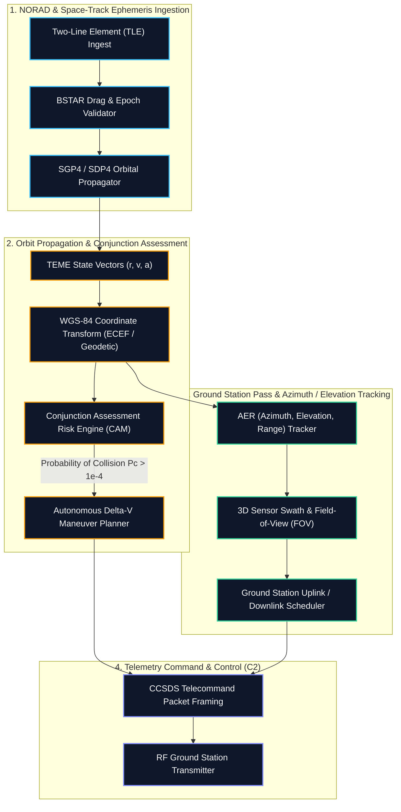
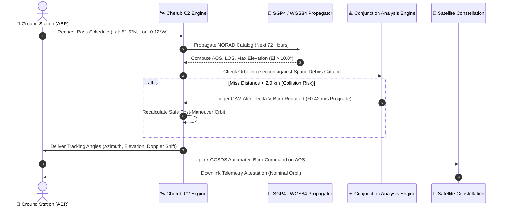

# 🛰️ Project Cherub — Autonomous Spacecraft Astrodynamics & C2 Engine

**Project Cherub** is a high-precision, autonomous spacecraft orbital mechanics, telemetry command-and-control (C2), and conjunction assessment runtime.

Built for low-Earth orbit (LEO), medium-Earth orbit (MEO), and geostationary (GEO) satellite constellations, Cherub couples real-time SGP4/SDP4 perturbation modeling with automated collision avoidance maneuver (CAM) planning.

---

## 🏛️ Autonomous Astrodynamics Workflow Pipeline

---

## 🔄 Real-Time Pass Prediction & Uplink Sequence

---

## 🚀 Key Features

- **High-Precision SGP4 / SDP4 Orbital Propagation**: Mathematical state vectors validated across circular, eccentric, and deep-space orbital regimes.
- **Automated Conjunction Assessment (CAM)**: Computes miss distance vectors, ellipsoidal covariance collision probabilities, and optimal delta-$v$ impulse maneuvers.
- **Real-Time 3D Ground Footprints**: Multi-spectral sensor swath mapping over WGS-84 oblate spheroid models.
- **Ground Station Pass Prediction**: Computes exact Acquisition of Signal (AOS), Loss of Signal (LOS), Time of Closest Approach (TCA), and Doppler shift compensation.

---

## 📄 License

Licensed under the **Apache License, Version 2.0**.
